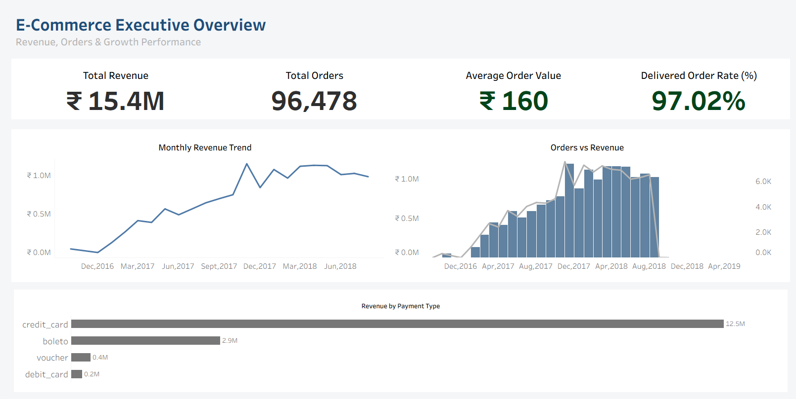
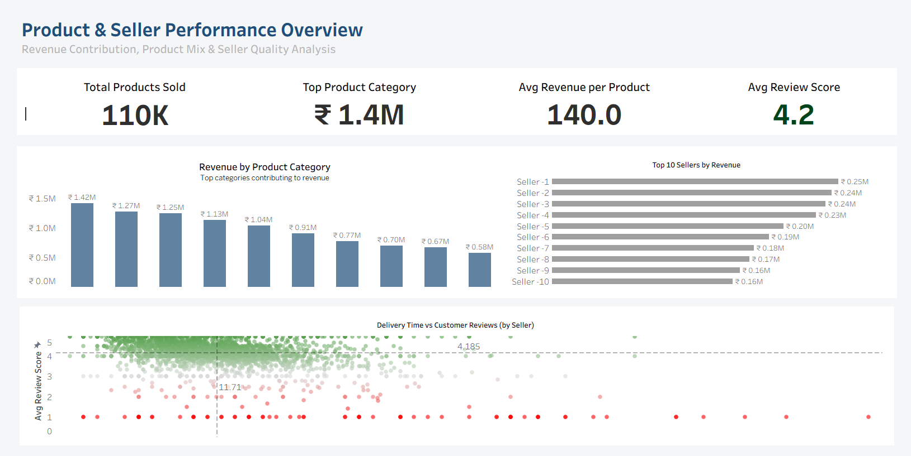
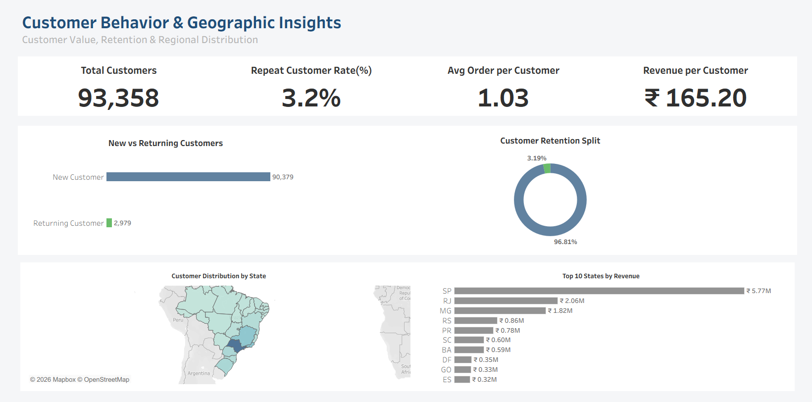

# E-Commerce Performance Analytics Dashboard (Tableau)

An end-to-end business intelligence project analyzing revenue, customer behavior, product performance, and seller insights using Tableau.

---

## Project Overview

This project analyzes 96,000+ orders generating ₹15.4M revenue.

The goal was to:
- Identify revenue drivers
- Analyze customer retention
- Evaluate seller performance
- Understand geographic revenue distribution

---

## Key Business Metrics

- Total Revenue: ₹15.4M
- Total Orders: 96,478
- Average Order Value: ₹160
- Delivered Order Rate: 97.02%
- Repeat Customer Rate: 3.2%

---

## Dashboard Pages

### 1. Executive Overview

Focus:
- Revenue trend analysis
- Orders vs revenue correlation
- Payment type contribution

---

### 2. Product & Seller Performance

Focus:
- Top revenue categories
- Seller revenue contribution
- Delivery time vs review impact

---

### 3. Customer & Geography Insights

Focus:
- Customer retention
- New vs returning split
- State-level revenue analysis

---

## Skills Demonstrated

- Data Modeling (Star Schema)
- KPI Design
- DAX / Calculated Fields
- Geographic Mapping
- Business Insight Extraction
- Dashboard UX Structuring

---

## Business Insights

- Revenue heavily dependent on credit card payments
- Extremely low repeat rate (3.2%) → retention opportunity
- Revenue concentrated in top 3 states
- Seller performance strongly impacts review scores

---

## Tools Used

- Tableau
- Excel / CSV
- Data Cleaning
